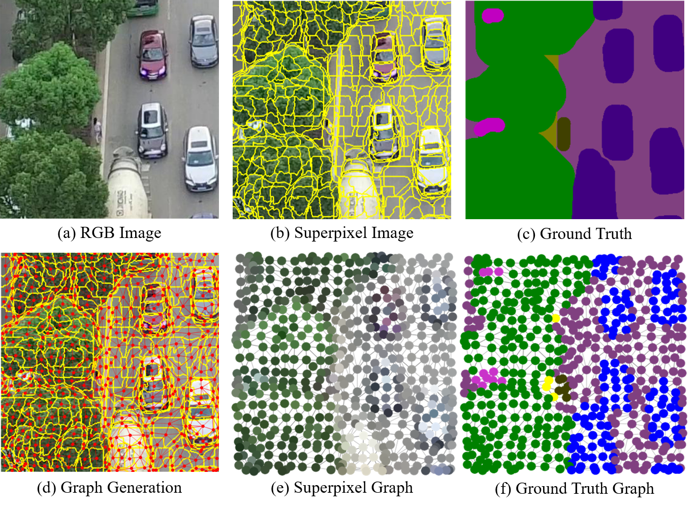
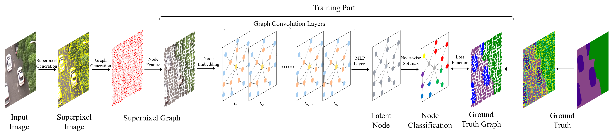

# Superpixel-based Graph Convolutional Network for Semantic Segmentation
## Citation
Feel free to use this code. No citation needed.

## Introduction
### Concept
Thie repository is an implementation for **Superpixel-GCN**([pdf](./img/project.pdf)).    
The concept of this framework is regarding Superpixel as a node of an graph.   
The proposed method aims classify the label of each superpixel(node) using GCN, and convert graph to image again.


<center></center>

### Architecture
<center></center>


## Implementation Detail
### Dataset
You can download [UAVid](https://uavid.nl/) dataset from here.    
Moreover, our framework can be used for various semantic segmentation dataset such as (DeepGlobe Landcover, ADE20K, Cityscapes, etc.)    
Note that thie repo includes [UAVidToolKit](https://github.com/YeLyuUT/UAVidToolKit) to encode ground truth image to labeled gt image.    
Other datasets are necessarily encoded as labeled ground truth.

### Superpixel
We are mainly using [SFCN](https://github.com/fuy34/superpixel_fcn) as superpixel prerpocessing. However, any other superpixel framework can be adopted.


### File tree
```
|-- data
|   `-- uavid
|       |--uavid_train 
|       |--uavid_val
|       `--uavid_test
|-- preprocessing
|   |-- UAVidToolKit
|   |-- superpixels
|   |   `--superpixel_sfcn
|   |-- uav_preprocessing_sfcn.py 
|   `-- uav_preprocessing_slic.py 
|-- SGNN
|   |-- GraphSage.py  
|   |-- dataloader.py  
|   |-- losses.py  
|   |-- test_eval_uav.ipynb  
|   |-- train.py  
|   |-- utils.py  
|   `-- yml
|       `--train_uav.yaml
```

## Tutorial
### Preprocessing
Create superpixel-graph using SFCN. 

```
cd preprocessing
python uav_preprocessing_sfcn.py
```
Then, ```*.bin``` files for train subset and val(test) subset will be created at ```pickles/```.   
Also, ```*.pickle``` files for val(test) subset is created at ```pickles/```.    
```*.bin``` files are used for training and validation(test), while ```*.pickle``` file is used for evaluation,    
because ```*.bin``` file is a list of ```DGL``` graphs, where ```*.pickle``` contains the superpixel mapping information.


### Set configures
Most of options are shown in ```yml/train_uav.yaml```.    
You can also use ```argparser``` in ```train.py``` instead of ```yaml``` configure.     
```yaml``` works as default options, and you may be able to let ```argparser``` override default setting.   

### Wandb
Be careful our methods contains ```wandb``` option.     
If you don't want to use ```wandb```, set ```wandb``` option in ```yaml``` file as ```False```.    
Otherwise, please change entity in ```wandb.init``` in ```train.py``` as your ```wandb``` name.

### Run Training
```
cd SGNN
python train.py
```
Checkpoints are saved every best epochs.    
If you want to save memory space, ```save_best_epoch_pth=False``` in ```*.yaml``` to restore only ```final.pth```.    
Note that ```trin_id``` will be created automatically following current Unix time.

### Test and Evaluation
Run ```test_eval_uav.ipynb```. It also follows configuration of ```train_uav.yaml```.    
